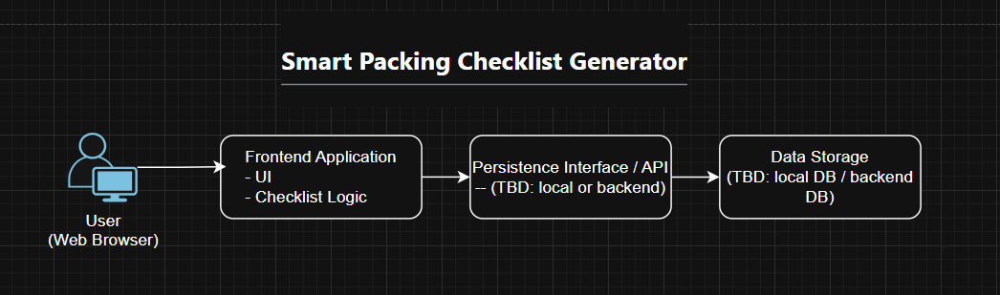

# Architecture Snapshot  
**Smart Packing Checklist Generator**

## Architecture Overview

The system uses a simple, modular architecture designed to support rapid iteration and clarity. It prioritizes maintainability and explicit logic over automation or predictive complexity.

## Architecture Diagram

*Image 1: A high-level architecture of the system’s major components and primary data flows.*
*Source diagram:* [`architecture-snapshot.drawio`](./diagrams/architecture-snapshot-1.drawio)

## Major Components

- **User (Web Browser)**  
  Interacts with the application UI.

- **Frontend Application**  
  Collects trip inputs, displays checklists, and tracks progress.

- **Persistence Interface / Backend API (TBD)**
  This component is used by the frontend to save/load trips, checklists, and templates (TBD: local storage for early prototype or an API service later).

- **Checklist Generation Logic**
  Runs in frontend and applies predefined rules and templates to generate packing lists based on trip context.

- **Data Storage (TBD)**  
  Persists trips, checklists, and reusable templates (Implementation might be local during prototyping phase or a database behind the backend service).

## Data Flow

1. User inputs trip details via the UI.
2. The frontend passes inputs to the checklist generation logic.
3. A checklist is generated and returned to the UI.
4. When the user makes modifications (packed items, custom edits), the frontend saves updates via a persistence interface (TBD: API or local storage).
5. When starting a new trip, the frontend loads saved templates (and optionally prior trips) through the same persistence interface and reuses them.

## Design Intent

This architecture is intentionally simple and rule-driven. It avoids unnecessary services or external dependencies to reduce complexity and risk during early development.

## Trade-Offs

- **Pros**
  - Easy to understand and test.
  - Predictable behavior.
  - Fast to iterate.

- **Cons**
  - Limited flexibility compared to AI-driven systems.
  - Manual rule updates required as scenarios expand.

## Design Intent & Trade-Off

This architecture keeps the checklist generation rule-based and close to the UI so the team can iterate quickly   and keep behavior predictable during early development. The main trade-off is that this simplicity limits scalability and future flexibility: as rules grow, client-side logic can become harder to manage and reuse, and moving persistence behind an API later may require refactoring boundaries that are intentionally “TBD” in the prototype.
