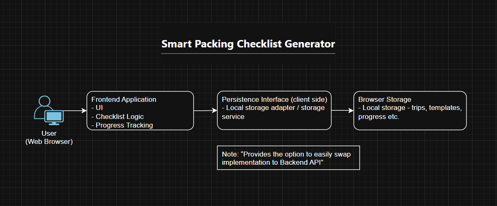

# Architecture Snapshot  
**Smart Packing Checklist Generator**

> Updated April 2026 to reflect the production system as deployed for Final Release.
> For the original early-development snapshot, see the git history of this file.

## Architecture Overview

The system is a full-stack, authenticated, multi-user web application. The frontend is a Vite-built vanilla-JS SPA served by an Express backend. User data is persisted in a SQLite database on a mounted EBS volume and accessed through Knex.js. Authentication uses Google OAuth 2.0 via Passport. The application is hosted on AWS Elastic Beanstalk with automated deployment from GitHub Actions.

## Architecture Diagram

> Note: The original `.drawio` diagram below reflects the early-development architecture.
> See [`/docs/final/week13-architecture.md`](../final/week13-architecture.md) for the current text-based component diagram.

*Image 1: Original early-development architecture (retained for project history).*
*Source diagram:* [`architecture-snapshot-2.drawio`](./diagrams/architecture-snapshot-2.drawio)

## Major Components

- **User (Web Browser)**
  Interacts with the SPA. Authenticated via Google OAuth redirect flow.

- **Frontend Application (`src/`)**
  Vanilla JS modules built by Vite. Collects trip inputs, generates checklists client-side, and communicates with the backend API for persistence. Manages auth state and UI transitions (login, trip list, form, edit mode).

- **Checklist Generation Logic (`src/checklistGenerator.js`)**
  Pure function that runs in the browser. Produces packing list items based on destination type and trip duration using predefined rules.

- **API Client (`src/apiClient.js`, `src/storage.js`)**
  Thin HTTP wrapper over `fetch`. All trip CRUD operations go through REST endpoints on the Express backend. Replaced the earlier localStorage persistence interface.

- **Express Server (`server.js`)**
  Hosts the API, serves the built frontend in production, manages sessions, and runs middleware for request correlation, logging, and error handling.

- **Authentication (`server/auth.js`)**
  Google OAuth 2.0 via Passport with session-based identity. Test-mode authentication header (`x-test-user-id`) allows E2E tests to bypass OAuth.

- **Data Layer (`server/storage.js`)**
  Knex.js query builder over `better-sqlite3`. Manages users, trips, and checklist items with ownership enforcement and transactional writes. Schema maintained through versioned migrations (`migrations/`).

- **Database (SQLite)**
  Production: file-backed on a persistent EBS volume (`/data/trips.db`). Development: local file (`data/trips.db`). Test: in-memory.

- **Logging (`server/logger.js`)**
  Winston-based structured JSON logging. Request correlation IDs propagated on every request. Production logs to console (for CloudWatch); development logs to file and terminal.

- **Infrastructure**
  AWS Elastic Beanstalk (single instance), EBS volume for database persistence, predeploy hooks for volume mounting and migrations, GitHub Actions CI/CD.

## Data Flow

1. User authenticates via Google OAuth redirect; session cookie is set.
2. User inputs trip details in the SPA form.
3. Frontend generates a checklist client-side from destination type and duration.
4. User reviews and saves; frontend POSTs trip + checklist to `/api/saveTrip`.
5. Server validates input, creates trip and checklist items in a database transaction.
6. Saved trips are listed via `GET /api/trips` (scoped to the authenticated user).
7. User can load, edit, update, or delete trips through the corresponding API endpoints.
8. All requests are logged with a correlation ID; errors return the ID for support triage.

## Trade-Offs

- **Pros**
  - Multi-user with per-user data isolation.
  - Server-persisted data survives browser/device changes.
  - Structured logging and request correlation support production debugging.
  - Automated deployment with health checks and migration safety.

- **Cons**
  - SQLite limits write concurrency; adequate for current single-instance deployment but would need replacement (e.g., PostgreSQL) for horizontal scaling.
  - Session storage is in-memory; server restart clears active sessions.
  - Single Elastic Beanstalk instance means downtime during deployments or instance replacement.
  - Checklist generation logic lives entirely in the frontend, making it invisible to server-side testing.

## Design Evolution

This architecture evolved from a client-side prototype (localStorage, no auth, no server) to a full-stack deployed system over the course of the project. Key transitions:

| Phase | Change |
|-------|--------|
| MVP | Client-side only, localStorage, single user |
| Beta | Added Express server, SQLite/Knex, Google OAuth, AWS EB deployment |
| Week 13 | Added observability (request correlation, structured logging, health diagnostics, centralized error handling), startup config validation, request ID sanitization |

The persistence interface abstraction from the original design made the storage migration straightforward — the frontend’s `storage.js` was re-pointed from localStorage calls to API calls with minimal UI disruption.
