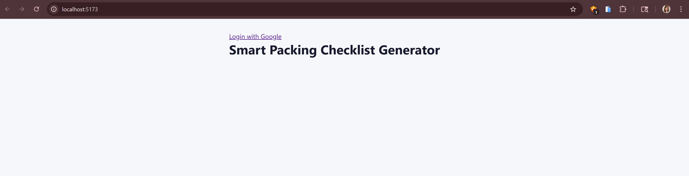
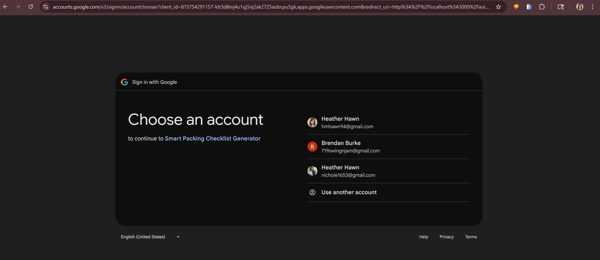
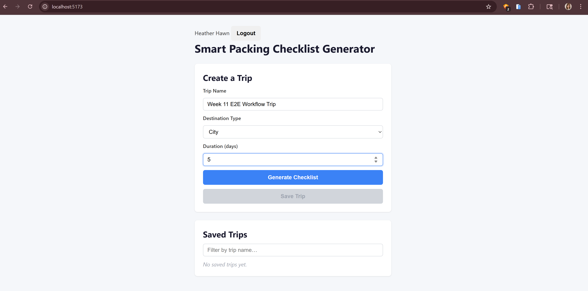
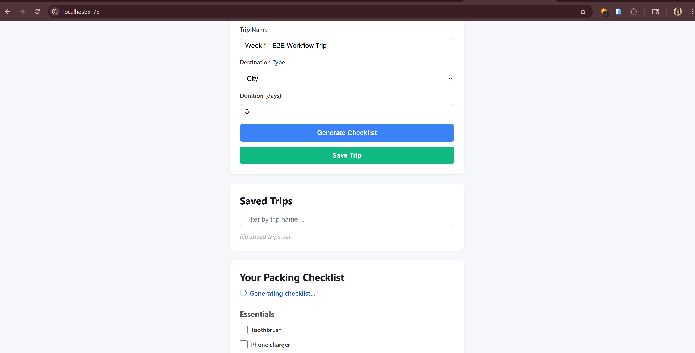
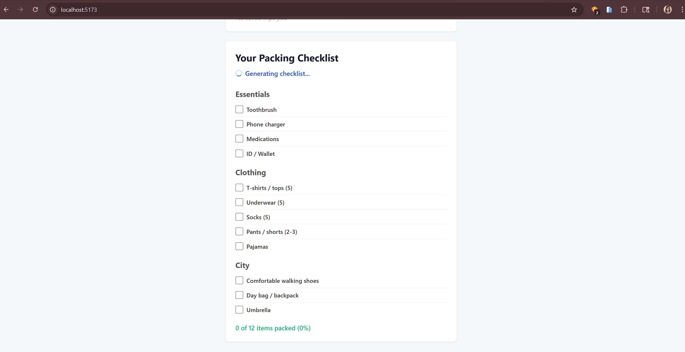
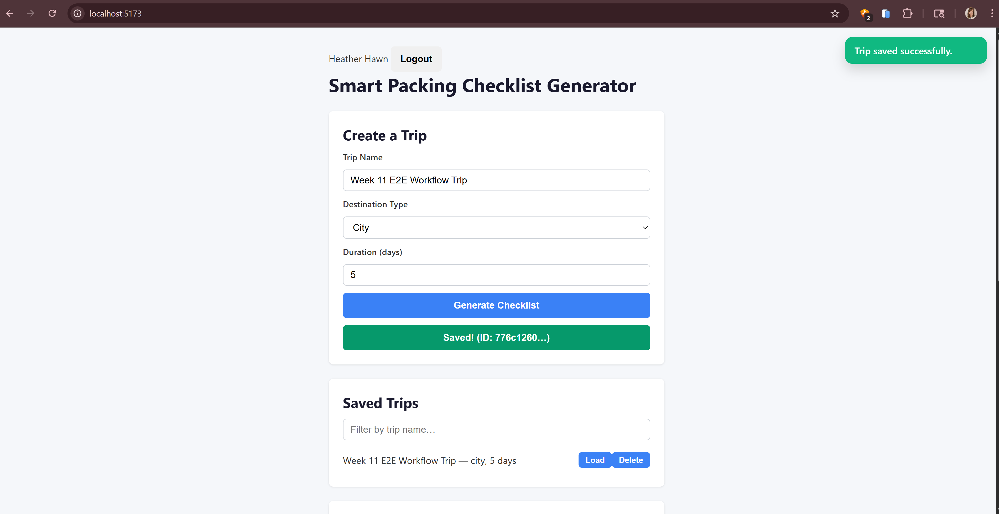
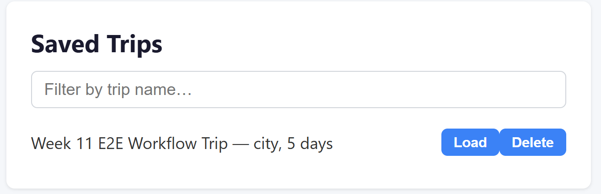

# Week 11 End-to-End Workflow Proof
## Smart Packing Checklist Generator

This workflow demonstrates meaningful system behavior across authentication, frontend UI, backend API, and persistence layers. It confirms that the core user journey is functional end-to-end.

---

## Primary Workflow: Create and Save a Trip

This workflow demonstrates a complete user journey across frontend UI, backend API, and persistence.

---

## Entry Point and User Role

- Entry Point: Application home page (`/`)
- User Role: Authenticated user (Google OAuth)

---

## Workflow Steps

1. User logs in via Google OAuth

2. User enters trip details:
   - Trip name
   - Destination type
   - Duration

3. User clicks **Generate Checklist**
   - Frontend calls checklist generation logic

4. Checklist is displayed in the UI

5. User clicks **Save Trip**
   - Frontend sends request to backend API

6. Backend validates request, enforces ownership, and persists trip
7. Saved trip appears in UI list

---

## System Components Involved

- Frontend (Vite + Vanilla JS)
  - `tripForm.js`
  - `apiClient.js`
- Backend (Node.js + Express)
  - `server.js`
- Database layer (SQLite via storage module)
- Authentication (Google OAuth)
- CI/Test layer (Playwright E2E tests)

---

## Expected Output / Final State

- A new trip is saved with:
  - Valid trip data
  - Generated checklist items
- Trip appears in the saved trips list
- No duplicate entries created
- UI reflects success state (toast or updated list)
- Data is associated with the authenticated user and isolated from other users

---

## Evidence

### PRs That Enabled This Workflow

This end-to-end workflow is the result of incremental development across multiple PRs integrating authentication, API functionality, persistence, frontend behavior, and testing.

Representative contributions include:

#### Authentication and Access Control
- Implemented google authentication #70  
- Week11/auth-and-frontend-integration-fixes #89  

These PRs introduced and stabilized the Google OAuth authentication flow, including session handling and protected API routes.

#### API and Backend Functionality
- Add GET /api/trips/:tripId endpoint #33  
- Wire frontend to Express API — MVP save trip path #22  
- Fix PR #22 review feedback: 404 handling, validation, naming #25  

These PRs enabled trip creation, retrieval, validation, and consistent API behavior.

#### Persistence Layer
- Migrate storage from JSON file to SQLite via Knex.js #57  
- Added data seed script #36  

These changes ensure trip data persists across sessions and reloads.

#### Frontend Integration
- Add saved trips list with load and filter #37  
- Week11/api-and-doc-alignment #95  

These PRs enabled checklist rendering, saved trip visibility, and API/UI alignment.

#### Schema and Data Consistency
- updated checklist payload key value to be packed #29  
- Week11/repo-hygiene-and-schema-cleanup #91

These changes standardized data structures across frontend, backend, and documentation.

#### Testing and CI
- Add demo-path tests: retrieve-after-update and boundary #38  
- ci: always report required checks #94  
- ci: add workflow_dispatch #96  

These PRs introduced workflow testing and CI improvements supporting validation of the system.

#### Infrastructure and Deployment
- Week11/aws beta hosting #92  

This enabled a hosted environment and configuration for persistence and deployment.

---

### Test Evidence

- Playwright E2E Tests:
  - `tests/e2e/primary-workflow.spec.js`
  - `tests/e2e/integration.spec.js`

Verified behaviors:
- User can log in
- User can create and save a trip
- Trip persists and can be reloaded
- Duplicate submissions are prevented

---

### Run Notes

Local test run:
- Started backend (`npm run server`)
- Started frontend (`npm run dev`)
- Executed Playwright tests (`npx playwright test`)
- Verified:
  - Trip creation
  - Checklist generation
  - Save + reload functionality

---

### CI Evidence

- CI pipeline includes E2E test stage (currently optional)
- Link to CI run: https://github.com/Georgia-Southwestern-State-Univeristy/term-project-group-4/actions