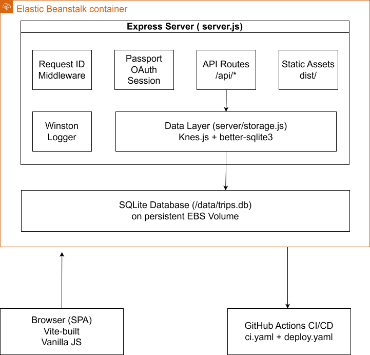

ex# Smart Packing Checklist Generator — Hand-Off Document

This document provides an overview of the system, its architecture, stack rationale, deployment, and guidance for future maintainers. It is intended to help a new team quickly understand how the project works, how to run it, what was accepted as a trade-off, and where to focus future improvements.

---

## System Overview

The Smart Packing Checklist Generator is a full-stack web application that allows authenticated users to create, manage, and track trip-based packing checklists.

### Core Features

- Google OAuth authentication (user-scoped data)
- Create trips with:
  - trip name
  - destination type
  - duration
- Generate packing checklists dynamically based on trip inputs
- Save, load, update, and delete trips
- Track packed/unpacked checklist items
- Auto-save checklist changes for saved trips
- Search/filter saved trips
- Edit existing trips with change detection and controlled update flow

---

### Current State

The system is functionally complete, deployed, and supported by automated unit, integration, and end-to-end testing.

Weeks 13–14 focused on:

- maintainability (refactoring brittle UI logic)
- observability (request correlation, structured logging, health diagnostics)
- regression protection (Playwright + backend test coverage)
- support readiness (error visibility and diagnostics)
- deployment hardening (release-candidate runbook and verification)

The system is now functionally stable, with improvements focused on clarity, reliability, and maintainability rather than feature expansion.

---

## Architecture Snapshot

The application is a Vite-built vanilla-JS SPA served by an Express backend. User data is persisted in a SQLite database on a mounted EBS volume and accessed through Knex.js. Authentication uses Google OAuth 2.0 via Passport. The application is hosted on AWS Elastic Beanstalk (single-instance) with automated deployment from GitHub Actions.

### Component Diagram



*Source diagram:* [`architecture-snapshot-3.drawio`](../architecture/diagrams/architecture-snapshot-3.drawio)

### Request Flow

1. Browser sends a request with the `connect.sid` session cookie and `x-request-id` header.
2. Request-ID middleware tags the request (sanitizes external IDs, generates a UUID if missing or malformed).
3. Passport session middleware verifies the user; `req.user` is populated.
4. Route handler validates input, calls Knex, SQLite responds.
5. Server returns a structured JSON response; errors include the request ID for support triage.
6. Winston logs an `HTTP_REQUEST` completion entry with method, path, status code, and latency.

### Detailed References

- [docs/architecture/architecture-snapshot.md](../architecture/architecture-snapshot.md) — full architecture snapshot with major components, data flow, trade-offs, and design evolution.
- [docs/final/week13-architecture.md](../final/week13-architecture.md) — Week 13 update with current component diagram, responsibility table, and architectural risks.

---

## Stack and Tool Choices

Each layer below is paired with a one-line rationale; ADRs are the authoritative source for each decision.

### Frontend

- **Vite** + **Vanilla JavaScript (ES Modules)** — DOM-driven UI with modular JS files
- **Why:** intentionally lightweight; no framework runtime overhead; fast iteration; state management is hand-rolled and covered by E2E tests rather than framework abstractions.

---

### Backend

- **Node.js** + **Express.js** (REST-style API)
- **Why:** minimal HTTP framework that fits the team's JavaScript skill set and SPA-companion needs without ORM or framework opinions.

---

### Database

- **SQLite** via **Knex.js** (query builder + migrations)
- **Why ([ADR-002](../adr/ADR-002.md)):** simple ops, zero external service, fine for current scale. Knex keeps the application database-agnostic so a future PostgreSQL migration is a config change plus a migration test pass — not a rewrite.

---

### Authentication

- **Google OAuth 2.0** via **Passport.js**, session-based authentication using `connect.sid` cookies
- **Why ([ADR-001](../adr/ADR-001.md)):** delegates password storage and account-recovery responsibility to Google; per-user data isolation enforced via `user_id` foreign keys; no custom credential management surface.

---

### Testing

- **Vitest** — Unit and integration tests (backend + logic)
- **Playwright** — End-to-end (E2E) testing using test-mode auth via `x-test-user-id` header

Covers:

- auth error handling
- edit-mode UI behavior
- change detection
- core workflows

---

### Observability (Week 13 Additions)

- Request correlation via `x-request-id` (sanitized — alphanumeric + `._-`, max 128 chars; replaced with a server-generated UUID otherwise)
- Structured JSON logging (Winston); `req.path` only in logs to avoid leaking query strings
- `/health` endpoint with diagnostics: uptime, config validity, version, database status
- Centralized 404 and error handling with request IDs in every error response
- Startup configuration validation (fail-fast for missing environment variables)

---

### Deployment

- **AWS Elastic Beanstalk** (single-instance) with **SQLite on a mounted EBS volume**
- **CI/CD** via GitHub Actions; predeploy hooks attach/mount EBS and run Knex migrations
- **Why ([ADR-003](../adr/ADR-003.md)):** fastest path from local SQLite to a hosted production environment with persistence; deferred RDS/PostgreSQL until scale or availability requirements demand it.

---

## Setup / Run Summary

### Prerequisites

- Node.js (LTS recommended)
- npm
- SQLite (local file-based, no external install required)

---

### Install Dependencies

```bash
npm install
```

---

### Run the Application Locally

```bash
npm run dev
```

- Frontend served via Vite
- Backend runs on Express server
- App typically available at: http://localhost:3000

---

### Environment Variables

Key environment variables:

- GOOGLE_CLIENT_ID
- GOOGLE_CLIENT_SECRET
- SESSION_SECRET
- SQLITE_PATH (optional override; production uses `/data/trips.db` on EBS)

In test mode:

- authentication is bypassed via `x-test-user-id` header
- used by Playwright and automated tests

---

### Running Tests

Run all tests:

```bash
npm test
```

Run E2E tests:

```bash
npm run test:e2e
```

Run a specific Playwright test:

```bash
npm exec playwright test --grep "test name"
```

---

## Accepted Known Constraints

These constraints are **deliberate trade-offs** for the current release scope, not unresolved bugs. Each is documented and surfaced here so a future team understands the system's intentional limits before changing them.

### 1. SQLite + Single-Instance Elastic Beanstalk Deployment

- Production runs on a single EB instance with SQLite persisted on an attached EBS volume.
- Result: no horizontal scaling, brief downtime during deployments, and tied to a single availability zone.
- **Why accepted:** matches the SQLite single-writer model; meets current load and operational-cost targets. Replacement path documented in [ADR-002](../adr/ADR-002.md) (Knex → PostgreSQL).

### 2. In-Memory Session Store

- `express-session` uses its default `MemoryStore`. All active sessions are cleared whenever the app restarts (including on every deploy and instance replacement).
- **Why accepted:** acceptable UX for the current user base; avoids introducing Redis/DB-backed session infrastructure for the project's scope.
- A persistent session store (e.g., `connect-sqlite3`, Redis) is the natural follow-on if multi-instance deployment is adopted.

---

## Technical Debt

These items are real cleanup work that the team would address with more time. Unlike the accepted constraints above, these are not intentional product decisions.

### 1. Duplicated Backend Validation Logic

- Trip payload validation is still duplicated across the create and update routes (~30 lines each)
- Risk of inconsistent validation behavior between POST and PUT
- Tracked in: [#129](https://github.com/Georgia-Southwestern-State-Univeristy/term-project-group-4/issues/129)

---

### 2. Checklist Auto-Save and Change Detection Complexity

Checklist behavior combines:

- UI rendering
- debounced auto-save
- change detection via serialized state comparison

Risks:

- tightly coupled logic
- harder to extend safely
- potential edge-case bugs with future features

---

### 3. Backend Structure Centralization

`server.js` currently handles routing, middleware, validation, configuration, and observability logic in a single file. Mixed responsibilities make the file harder to scale or extend cleanly.

---

### 4. Limited Backend Test Depth

E2E coverage is strong; backend coverage is lighter. Remaining gaps:

- deeper unit tests for business logic
- validation edge cases
- error path testing across all routes

---

## Recommended Next Steps for a Future Team

### 1. Centralize Backend Validation Logic

- Extract shared validation layer
- Reuse across create/update routes
- Add dedicated unit tests

---

### 2. Simplify Checklist State Management

Separate:

- change detection
- persistence
- UI rendering

Replace serialized comparison with more explicit state tracking.

---

### 3. Modularize Backend Structure

Break `server.js` into:

- routes
- middleware
- validation
- config

Do this incrementally to avoid regressions.

---

### 4. Expand Backend Test Coverage

Add unit tests for:

- validation logic
- storage layer
- error handling paths

Keep E2E tests focused on user workflows.

---

### 5. Lift the Accepted Constraints When Scale Demands It

The accepted constraints above (SQLite + single-instance, in-memory sessions) are not permanent. When scale or availability requirements change, the migration paths are:

- Move from SQLite to PostgreSQL (Knex makes this primarily a config change — see [ADR-002](../adr/ADR-002.md))
- Add a persistent session store (e.g., `connect-sqlite3` or Redis)
- Move to multi-instance Elastic Beanstalk with sticky sessions or a shared session store

---

### 6. Continue Observability Improvements

- Add request tracing across services (if expanded)
- Improve log aggregation and monitoring in production
- Add alerting on failures

---

## User and Admin Guidance

- **[docs/user-guide.md](../user-guide.md)** — End-user reference: how to log in, create and manage trips, generate and track checklists, and edit saved trips.
- **[docs/admin-guide.md](../admin-guide.md)** — Operator reference: production environment, deployment overview, environment variables, common maintenance tasks, and references to API documentation.

---

## Related Documentation

### Architecture & Design

- [docs/architecture/architecture-snapshot.md](../architecture/architecture-snapshot.md) — Full architecture snapshot
- [docs/final/week13-architecture.md](../final/week13-architecture.md) — Week 13 architecture update with component diagram and risk table
- [docs/adr/ADR-001.md](../adr/ADR-001.md) — Authentication & identity decision
- [docs/adr/ADR-002.md](../adr/ADR-002.md) — Database choice (Knex + SQLite, portable to PostgreSQL)
- [docs/adr/ADR-003.md](../adr/ADR-003.md) — Beta hosting on Elastic Beanstalk with SQLite on EBS

### API

- [docs/api/README.md](../api/README.md) — API overview and authentication flow
- [docs/api/openapi.yaml](../api/openapi.yaml) — OpenAPI 3.0.3 specification (Swagger UI served at `/docs`)

### Deployment & Operations

- [docs/final/week14-runbook.md](../final/week14-runbook.md) — Release-candidate deployment verification runbook
- [docs/deployment/beta-deploy.md](../deployment/beta-deploy.md) — Beta deployment notes (superseded by the runbook above)

### Observability

- [docs/final/week13-observability.md](../final/week13-observability.md) — Observability and support visibility deep-dive

### Release & Status

- [docs/releases/release-candidate.md](../releases/release-candidate.md) — Release-candidate notes and executive summary
- [docs/final/week14-triage.md](../final/week14-triage.md) — Final bug triage and disposition plan

---

## Final Notes

The system is functionally complete and stable, with improvements made in Weeks 13–14 around:

- observability
- reliability
- regression protection
- frontend state clarity
- deployment hardening

At this stage, the priority is not adding features, but:

- closing the technical debt above
- maintaining the accepted constraints' documented migration paths
- strengthening system reliability

With continued incremental improvements, the system is well-positioned to be maintained and extended by a future team.
