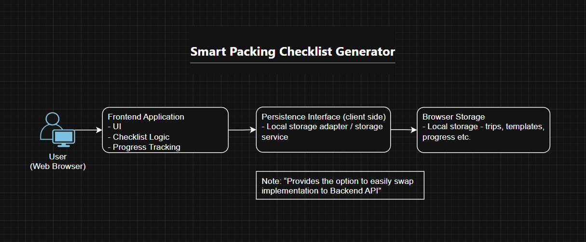

# Midterm Technical Snapshot of Smart Packing Checklist Generator 

## Architecture Overview

The system built with a frontend UI layer, backend API layer, and persistent data storage.

### High-Level Architecture Diagram



**View the full architecture details:** [Architecture Snapshot](../architecture/architecture-snapshot.md)

**Key Components:**
- **Frontend :** React UI for trip planning and checklist management
- **Backend API (Express.js):** RESTful endpoints for CRUD operations on trips and checklists
- **Storage Layer:** JSON file-based persistence at `data/trips.json`
- **Checklist Generator:** Rule-based logic for destination and duration-aware packing lists


## What's Implemented

Each bullet maps to a locked MVP user story from [scope-lock.md](scope-lock.md).

1. **Trip Creation** — Form captures trip name, destination type (City / Beach / Outdoors), and duration (1–30 days). Server validates all required fields and returns a unique trip ID.
2. **Checklist Generation** — Rule-based generator produces packing items by category (Essentials, Clothing, destination-specific, Extended Trip). Clothing quantities scale with duration; trips longer than five days add laundry items.
3. **Trip Persistence** — `POST /api/saveTrip` writes trips to `data/trips.json` with file-level locking and atomic writes to prevent corruption.
4. **Progress Tracking** — Checklist items toggle between packed and unpacked in the UI with a live progress bar showing "X of Y items packed (Z%)".
5. **Checklist Synchronization** — `PUT /api/trips/{tripId}` persists checklist changes to the server so progress survives a browser refresh.
6. **Trip Retrieval** — `GET /api/trips` and `GET /api/trips/{tripId}` return saved trips. The frontend lists all saved trips with a load button and supports client-side name filtering.
7. **Seed Data** — `npm run seed` populates three example trips (beach, hiking, city) so the demo starts with realistic data.
8. **API Documentation** — Swagger UI served at `/docs`, backed by an OpenAPI spec in `docs/api/openapi.yaml`.
9. **CI Pipeline** — Every PR runs ESLint and Vitest (23 tests) via GitHub Actions; merge is blocked on failure.

---

## What's Missing (Beta Scope)

These items are explicitly deferred and represent the highest-value work for Weeks 9–12.

1. **User Authentication** — No login or session management; all trips are globally visible. Auth is required before any multi-user deployment (ADR-001).
2. **Trip Deletion** — Users can create and update trips but cannot remove them. A `DELETE /api/trips/{tripId}` endpoint is needed.
3. **Database Migration** — Storage is a single JSON file. Moving to SQLite or a similar embedded database would improve reliability and enable concurrent access.
4. **Custom Checklist Items** — Users cannot add, rename, or remove individual items. The generator output is take-it-or-leave-it.
5. **Conflict Handling** — Concurrent PUT requests can silently overwrite each other. Optimistic concurrency (e.g., an ETag or version field) would prevent data loss.
6. **UI Error Feedback** — Network and validation errors surface minimally. Structured toast notifications or inline messages would improve the experience.

---

## System Setup & Execution

**For installation and running instructions, see the [README](../../README.md):**
- [Getting Started](../../README.md#getting-started)
- [Running Locally](../../README.md#running-locally)
- [Development Commands](../../README.md#development-commands) (includes `npm run seed`)


## Test Coverage & Status

### Test Files

**1. `app.test.js`** (1 test)
- CI smoke test — verifies the test runner executes correctly

**2. `tests/checklistGenerator.test.js`** (7 tests)
- Verifies essential items are always included regardless of destination
- Validates destination-specific items (beach, outdoors, city)
- Confirms beach items are excluded for non-beach destinations
- Tests clothing quantity scaling based on trip duration
- Ensures extended trip items appear for 5+ day trips
- Validates item structure (`id`, `name`, `category`, `packed`)

**3. `tests/server.test.js`** (15 tests)

**POST /api/saveTrip (7 tests)**
- Creates trip with valid payload and returns ID
- Rejects missing required fields
- Validates duration is a positive integer
- Validates duration is not zero
- Validates checklist items have `packed`, `id`, and `category` fields

**GET /api/trips (1 test)**
- Returns saved trips after creation

**GET /api/trips/:tripId (3 tests)**
- Returns a single trip by ID
- Returns 404 for non-existent trip ID
- Returns updated data after a PUT modification

**GET /api/trips/:tripId — boundary (1 test)**
- `getTripById` returns null when data file is absent

**PUT /api/trips/:tripId (3 tests)**
- Updates checklist on an existing trip
- Returns 404 for non-existent trip ID
- Validates duration on updates


### Running Tests

```bash
# Run all tests
npm run test

# Expected output: 23 tests passing across 3 test files
```

---

## Continuous Integration

### CI Pipeline: `.github/workflows/ci.yaml`

Runs on every pull request to `main`.

**Stages:**

1. **Code Linting** (`npm run eslint`)
   - ESLint code quality checks
   - Blocks merge if violations found

2. **Unit Tests** (`npm run test`, runs after linting passes)
   - Vitest + Supertest framework
   - 23 tests covering checklist generation and API endpoints
   - Tests both positive and negative cases
   - Blocks merge if any test fails

### Current CI Status
- ✅ Linting checks active
- ✅ Unit test suite active


